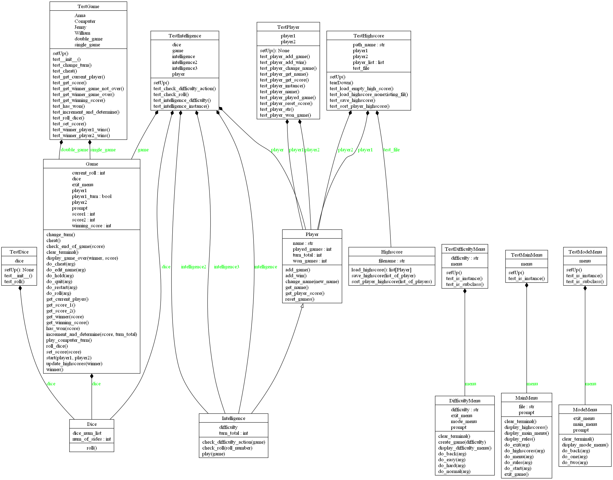

# 🐽Pig Dice Game🐽

This repository contains a Python implementation of the Pig dice game, a simple two-player game where the goal is to reach a certain score before your opponent. The game also includes a single-player mode against a computer opponent.

#### Collaborators
- [Bianca Casetta](https://github.com/biancacasetta)
- [PeiShan Lu](https://github.com/peishh)
- [André Sandblom](https://github.com/AndreSandblom)

## 🎲Implementation

### 🎮 Basic Game Rules
- Each player starts with a score of 0.
- On each turn, a player rolls a six-sided die.
- If the player rolls a 1, their turn ends, and they lose all the points accumulated during that turn.
- If the player rolls a number other than 1, the number is added to their turn total, and they can choose to roll again or hold.
- If the player holds, their turn total is added to their overall score, and the turn ends.
- The first player to reach a score of 100 or more wins the game.

### 🖥️ Computer Intelligence
- The computer player, represented by the `Intelligence` class, implements different strategies based on the difficulty level chosen (easy / normal / hard).
- These strategies aim to make the computer player more or less intelligent in terms of the percentage of disadvantage that each strategy represents.
- It does **not** manipulate probability by making it more or less likely to roll a 1, so sometimes it may feel like the **hard** mode is easier than the **easy** mode, but that is just luck.

#### 🧠 Computer strategies
- **EASY - 'Hold at 20'**: Each turn, the player rolls until they score 20 or more, then holds. This strategy has an 8% disadvantage against optimal play.
- **NORMAL - 'Hold at 25'**: Each turn, the player rolls until they score 25 or more, then holds. This has a 4.2% disadvantage against optimal play.
- **HARD - 'End race or keep pace'**: If either player has a score of 71 or higher, roll to win. Otherwise, hold on 21 plus the difference between scores divided by 8. This has a 0.9% disadvantage against optimal play.

## 🎲Installation and Usage

1. Clone the repository to your local machine.
2. Navigate to the project directory in GitBash.
3. Run `make version` to check the Python version being used.
4. Run `make venv` to create the virtual environment folder.
5. Run `. .venv/Scripts/activate` to activate the virtual environment and work inside it.
5. Run `make install` to install all tools included in the `requirements.txt` file.
6. Run `make installed` to verify that all necessary tools have been installed.
7. Navigate to the directory `/src/pig`.
8. Run `python -m main` in Windows Powershell or
9. In GitBash and run `code .` to open Visual Studio Code and run the `main.py` file to start the game.
10. Follow the on-screen instructions to play the game.

## Testing

To run the complete test suite and generate a coverage report, use the following commands inside the TestDrivenDev folder:

```bash
make test
```

## 📃Documentation

All the documentation is found in `src/pig/doc/api`. 

To regenerate the documentation from the code, you can use the following steps:

1. Navigate to the project directory `src/pig/`.
2. If using Windows, run `make pdoc`, otherwise run `make pydoc`.
3. To visualise the documentation on a browser, just open the .html files.

## 🗃️UML Diagrams

The UML diagrams for classes and packages are found in `src/pig/doc/uml`.

### Class Diagram



### Package Diagram


To regenerate the UML diagrams of the documentation, follow these steps:

1. Navigate to the project directory `src/pig/`.
2. Run the following command:

```bash
make pyreverse
```
